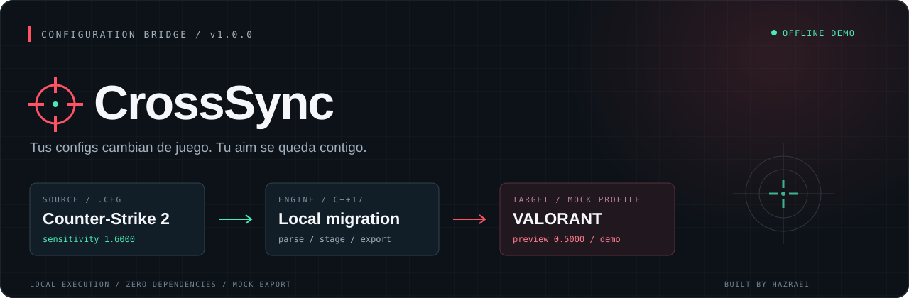

<p align="center">
  
</p>

<p align="center">
  <a href="https://github.com/hazrae1/crosssync/actions/workflows/build.yml"></a>
  
  
  <a href="LICENSE"></a>
</p>

<p align="center"><strong>Tus configs cambian de juego. Tu aim se queda contigo.</strong></p>
<p align="center">Consola de migración en C++ para dar por terminado, de una vez, el trámite de pasar de CS a Valorant.</p>

CrossSync presenta un flujo de importación, calibración y exportación con lectura de CFG, progreso en consola y un perfil JSON. Es un **proyecto de broma con una demo ejecutable**: la transferencia es ficticia y el resultado es un reporte local.

## Vista de la consola

```text
   +------------------------------------------------------+
   |  C R O S S S Y N C                         v1.0.0    |
   |  CS2  ->  VALORANT          CONFIGURATION BRIDGE     |
   +------------------------------------------------------+

  SESSION   LOCAL / OFFLINE DEMO
  SOURCE    examples/autoexec.cfg
  TARGET    output/valorant-profile.demo.json

  [==..................]  10% Initialize migration workspace
  [======..............]  30% Parse source configuration
  [===========.........]  55% Calibrate sensitivity preview
  [===============.....]  75% Stage crosshair and keybind metadata
  [==================..]  90% Validate mock profile schema
  [====================] 100% Mock profile exported

  MIGRATION PREVIEW
  --------------------------------------------------------
  Mouse sensitivity    1.6000 -> 0.5000 (demo)
  Crosshair color      #32FFA0
  Source keybinds      5 staged
  CFG commands         12 read / 1 ignored

  Demo session complete.
  Tus configs ya cruzaron. Tu aim sigue siendo tu responsabilidad.
  Joke simulator: fictional values; no game settings were applied.
```

## Qué incluye

| Módulo | Comportamiento de la demo |
| --- | --- |
| CFG reader | Lee sensibilidad, parámetros de mira y binds de un archivo indicado. |
| Sensitivity preview | Usa una escala ficticia para representar la etapa de calibración. |
| Crosshair staging | Conserva color RGB y medidas de origen como metadatos. |
| Keybind staging | Guarda las teclas y comandos como texto. |
| Profile export | Escribe un JSON propio con `simulation: true`. |
| Dry run | Muestra el flujo sin crear archivos. |

## Inicio rápido

Descarga el paquete de tu plataforma en [Releases](https://github.com/hazrae1/crosssync/releases/latest), extráelo y abre una terminal en esa carpeta.

**Windows / PowerShell**

```powershell
.\crosssync.exe
.\crosssync.exe --input examples/autoexec.cfg --output output/valorant-profile.demo.json
.\crosssync.exe --dry-run --fast
```

**Linux**

```bash
chmod +x crosssync
./crosssync --input examples/autoexec.cfg
./crosssync --dry-run --fast
```

La ejecución sin argumentos usa un perfil de ejemplo incorporado. El reporte predeterminado se escribe en `output/valorant-profile.demo.json`; repetir la ejecución reemplaza ese reporte.

## Compilar desde el código

Necesitas CMake 3.16 o posterior y un compilador con C++17. En Windows puedes usar Visual Studio con las herramientas de C++.

```bash
git clone https://github.com/hazrae1/crosssync.git
cd crosssync
cmake -S . -B build -DCMAKE_BUILD_TYPE=Release
cmake --build build --config Release --parallel
ctest --test-dir build -C Release --output-on-failure
```

Ejecuta `build/Release/crosssync.exe` con Visual Studio, o `build/crosssync` con un generador de una sola configuración en Linux.

## Opciones

| Opción | Uso |
| --- | --- |
| `--input <file.cfg>` | Lee el archivo indicado; por defecto usa la muestra incorporada. |
| `--output <file.demo.json>` | Elige la ruta del reporte de demo. |
| `--dry-run` | Ejecuta la vista previa sin escribir el reporte. |
| `--fast` | Quita las pausas de presentación. |
| `--no-color` | Desactiva los colores ANSI. También respeta `NO_COLOR`. |
| `--help` | Muestra ayuda. |
| `--version` | Muestra la versión. |

## Alcance de la simulación

El nombre y el flujo imitan una utilidad de migración. **No cambia ajustes de CS ni de Valorant** y el JSON no es un formato que Valorant pueda importar. El divisor `3.2` es una constante ficticia de la demo; no representa una conversión verificada entre juegos.

Los archivos se procesan localmente. El ejecutable no solicita cuentas, no accede a carpetas de juegos y no hace peticiones de red. Solo lee la entrada que indiques y escribe el reporte solicitado. Los comandos `exec`, `alias` y demás comandos ajenos a la muestra se ignoran; ningún comando del CFG se ejecuta.

Para el detalle del flujo y del formato, consulta [la arquitectura](docs/architecture.md) y [el reporte de demo](docs/profile-format.md).

## Desarrollo

GitHub Actions compila y prueba el parser y la CLI en Windows y Linux. Cada ejecución genera un paquete portable. Los CFG personales y los reportes generados quedan fuera de Git mediante `.gitignore`; el único CFG incluido es la muestra inventada de `examples/`.

Licencia [MIT](LICENSE). Proyecto independiente, sin afiliación con Valve ni Riot Games.
